## HotCaffeine：热咖啡

高性能，高可靠的热点数据探测系统 - 基于京东的hotkey项目优化而来。

**架构如下**：

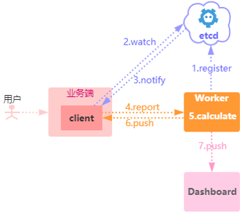

**组件介绍**：

1. Etcd：配置中心，用于服务发现和配置等。
2. client：客户端SDK，用于数据收集上报和接收热key。
3. Worker：用于接收客户端数据上报和热key计算。
4. Dashboard：管理后台和数据展示。

**调用流程**：

1. Worker启动后注册到etcd。
2. 客户端通过etcd监视worker地址。
3. Etcd通知客户端etcd变动。
4. 客户端上报统计数据到worker。
5. Worker收到统计数据计算热key。
6. Worker将热key推送给客户端。
7. Worker将热key推送给Dashboard。

**特性**：

- 高性能：内置高性能缓存库caffeine实现数据缓存和统计。

  *3核10G内存的worker实例支持每秒10万key探测。*

- 高可用：任何组件宕机或异常不影响接入业务。

- 准确性：采用sentinel滑窗计数，防止时间影响速率。

- 实时性：秒级发现推送热点数据。

- 扩展性：支持大规模接入，支持水平扩容。

## 一、环境初始化

HotCaffeine数据采用redis存储(下载[链接](https://download.redis.io/releases/))，故redis务必开启持久化机制。

#### 1. redis数据初始化

redis安装配置步骤略去，安装好后初始化如下数据：

hset user admin@admin.com "{\"userName\": \"admin@admin.com\", \"pwd\":\"hQ6xcq67rh0nn/0sl82paQ==\", role:\"ADMIN\"}"

#### 2. ETCD权限设置

注意etcd需要为V3版本，下载链接[参考](https://github.com/etcd-io/etcd/releases/tag/v3.4.14)，etcd安装配置步骤略去。

etcd的安全模型如下：

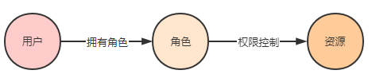

HotCaffeine采用如下鉴权保障安全性：

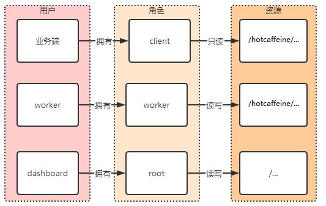

1. 针对客户端，需要单独的用户名和密码，但是他们共同拥有同样的角色，就是client，而client对资源/hotcaffeine/只有只读权限。
   *注：如果每个客户端都具有单独的角色，设计过于复杂，对于内网应用来说，只读安全性应该够了。后续如果需要精细控制，客户端无需任何修改，在etcd中可以为每个业务端再分配单独的角色。*
2. 针对worker，由于是内部应用，单独建立一个worker的角色，对资源/hotcaffeine/具有读写权限。
3. 针对dashboard，由于是内部应用，需要给各个用户赋权，故其拥有root用户和权限。

**etcd权限初始化如下**：

将etcd-auth.sh放到etcd安装目录下，执行。root密码输入H&O%T=C9AFF]。worker密码输入=+WK%&#*。

或者直接执行com.hotcaffeine.common.etcd.EtcdAuthInit.java

## 二、Dashboard使用

http://127.0.0.1:8081

用户名：admin@admin.com  密码：admin

#### 1. app配置

* 新增app：客户端接入名称

  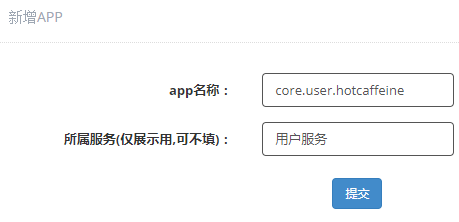

* 关联app：一个app属于多个用户时，其他用户可以关联该app。

  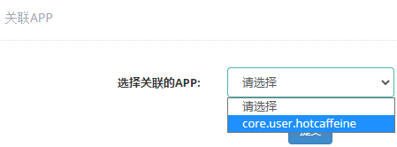

#### 2. 规则配置

* 缓存规则

  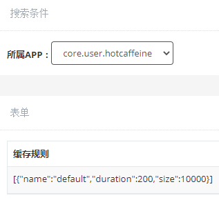

  * name：缓存名，每条**key规则**都需要关联一个缓存规则。
  * duration：缓存过期时间，单位：秒。
  * size：缓存大小。

* key规则：

  ```
  [
      {
          "key":"*",
          "prefix":false,
          "cacheName":"default",
          "interval":1,
          "threshold":100,
          "enableLocalDetector":false,
          "topkCount":100,
          "useTopKAsHotKey":false
      }
  ]
  ```

  * key：精准匹配或前缀匹配名，*表示为默认规则。
  * cacheName：缓存规则的名字。
  * prefix：是否为前缀匹配。
  * interval：滑动窗口时间间隔。
  * threshold：在interval达到threshold即变为热点数据。
  * enableLocalDetector：是否开启本地检测。
  * topkCount：topk的数量。
  * useTopKAsHotKey：是否使用topk作为热点数据。

  **缓存规则和key规则是一对多的关系。**

  精准匹配：即直接在代码中使用**key规则**中配置的key，详情请参考客户端使用。

  前缀匹配：如果缓存的key是有规律的，可以使用前缀匹配，假如有如下key规则：

  api:user:vip

  api:user

  可以针对这两种key设置不同的规则，前缀匹配会优先匹配较长的串，例如：

  api:user:vip:1234会优先匹配api:user:vip对应的规则，而不是api:user对应的规则。

#### 3. 实时热点

该模块可以查看各个规则的热点数据，默认只保留1万条，如下：

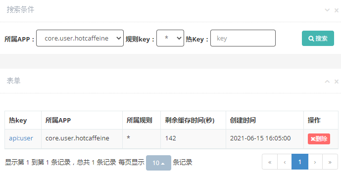

点击**热key**名可以查看热key在各个客户的实例对应的值：

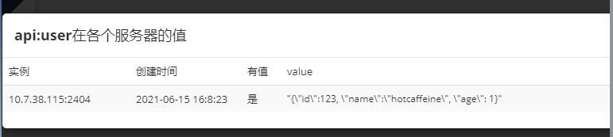

#### 4. 调用量分布

该模块用于**辅助业务发现key的分布情况，用于设置缓存大小和过期时间等重要指标，以满足某个命中率。**

下面举个具体的例子来说明一下，假设业务系统在某段时间内共有如下6个key访问，访问总量为100：

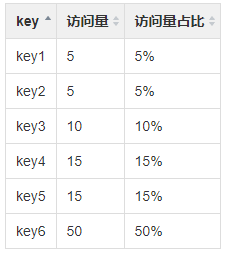

那么，如果这段时间内，**key6在缓存中的话，命中率就能达到50%。而key1和key2在缓存中的话，命中率仅为10%。**

根据这个简单的例子，来看下调用量分布：

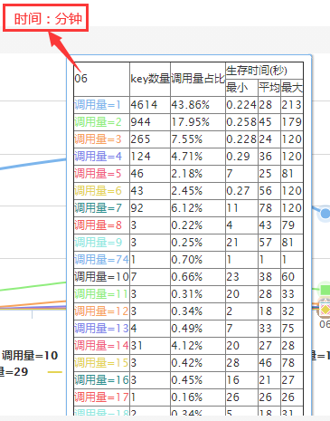

- **左边第一列**是调用量，也就是上面那个例子中说的访问量。
- **第二列**是key的数量，根据这列可以大概知道key的多少(非重复)，进而可以设置缓存大小。
- 第三列是调用量占比，比如 以第二行的数据为例来说明一下：
  - 调用量=2的key有944个，那么调用量为2的key的总调用量为1888，它占本次统计的总调用量的比例为17.95%。
  - 也就是说如果把调用量为2的key都缓存下来，需要缓存大小为944，命中率为17.95%。
- **第四列**是key的生存时间数据，可以参照个这个数据设置缓存的过期时间。

注意: **这些统计不包含已经变热的数据**，建议业务方一开始把热点阈值调大，让所有的key都上报，再参考调用量分布调整缓存大小和过期时间。

#### 5. TopK热键

默认hotkey探测热键采用的是阈值，即达到某个阈值即认为变热了。

topk作为阈值规则的补充，从另外一个维度来选择热键，它的度量指标是访问量，即**访问量最高的k个键作为热键**。

同样，**topk统计的数据不包含已经变热的数据，默认每分钟进行一次数据统计**。

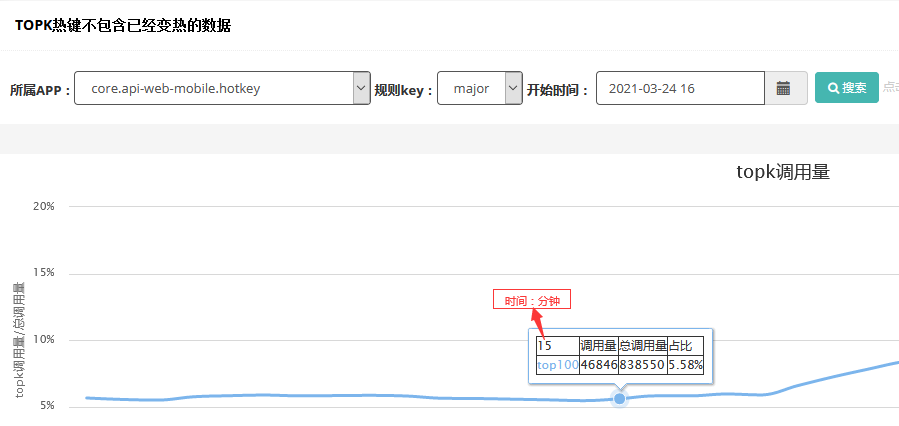

此曲线图纵坐标轴含义是topk的访问量与总量的比例，即可以认为，此段时间内，如果将这些topk的键缓存下来，命中率可以达到此比例。

鼠标放到曲线点上展示的是具体的数据情况。当点击该曲线点时，可以看到具体的topk数据，如下：

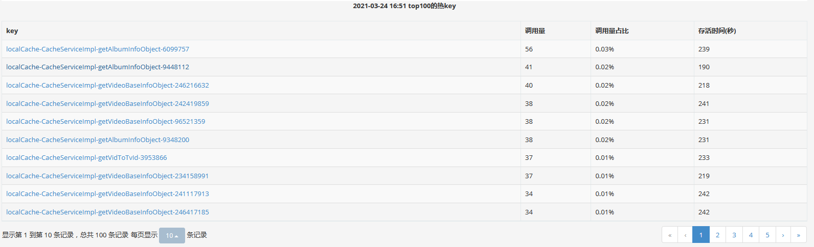

这里的调用量是指从key上报开始，如果后续持续的有数据上报会持续统计。

存活时间是指从key上报开始，至统计时的时间

点击key的名字即可看到该key实时的滑动窗口数据，如下：

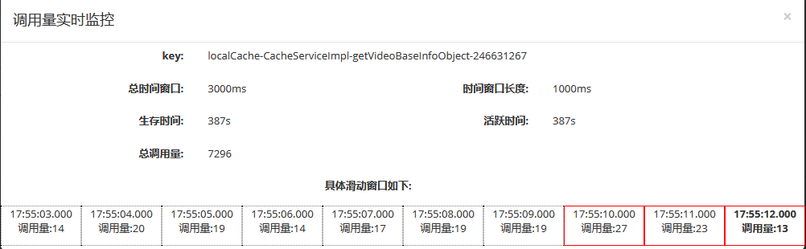

**各项指标含义如下：**

- 总时间窗口：在key规则里配置的滑动窗口时间。
- 时间窗口长度：每个时间窗口是多少ms。
  - 默认如果总时间窗口为1秒，有2个滑动窗口。
  - 两秒钟有四个滑动窗口。
  - 3秒及以上每秒一个滑动窗口。
  - 最多不能超过10秒。
- 生存时间：key从创建到目前一共存在的时间。
- 活跃时间：类似生存时间，在每分钟统计topk时此key的滑动窗口没有有效的量将会把活跃时间置0。
- 总调用量：key从创建导目前一共被访问的次数。

**滑动窗口：**

- 滑动窗口默认1秒钟拉取一次数据，最左边为旧的窗口，最右边为最近的窗口。
- 窗口虚线表示该窗口已经废弃（超过有效窗口时间的为废弃）。
- 窗口红色实线表示该窗口有效，窗口内文字如果红色加粗，表示该窗口正在计数。

## 三、客户端的使用

#### 1.pom

```
<dependency>
    <groupId>com.hotcaffeine</groupId>
    <artifactId>annotation</artifactId>
    <version>1.0</version>
</dependency>
```

#### 2.日志

```
<appender name="hotcaffeine" class="ch.qos.logback.core.rolling.RollingFileAppender">
    <file>${LOGS_DIR}/hotcaffeine.log</file>
    <rollingPolicy class="ch.qos.logback.core.rolling.TimeBasedRollingPolicy">
        <fileNamePattern>${LOGS_DIR}/otherdays/hotcaffeine.log.%d{yyyy-MM-dd}</fileNamePattern>
        <maxHistory>10</maxHistory>
    </rollingPolicy>
    <encoder>
        <pattern>%d{yyyy-MM-dd HH:mm:ss.SSS} {%thread} %-5level %logger{50}-%L - %msg%n</pattern>
    </encoder>
</appender>
<logger name="hotcaffeine" level="info" additivity="false">
    <appender-ref ref="hotcaffeine" />
</logger>
```

#### 3.初始化

```
HotCaffeineDetector hotCaffeineDetector = new HotCaffeineDetector.Builder().endpoints("http://127.0.0.1:2379").appName("core.user.hotcaffeine").build();
hotCaffeineDetector.start();
HotCaffeine hotCaffeine = hotCaffeineDetector.build();
```

#### 4.使用方式

```
/**
 * 满足热点阈值的key会返回true
 */
hotCaffeine.isHot(key)

/**
 * 此种使用方式将会把redis里满足热点阈值的数据会存储在HotCaffeine中
 */
public Video get(String key){
    return hotCaffeine.getValue(key, k->{
        return redis.get(k);
    });
}
```

#### 5.异步通知

当key变成热键时，支持异步的方式进行通知，需要实现如下接口：

```
public interface IKeyListener {
     
    /**
     * key变热时通知，只通知一次，不会重复通知
     * 如果需要缓存hot(String key)的返回值，请将needCacheValue返回为true
     * 尽量一秒内返回
     * @param key
     * @return 需要缓存的值
     */
    public Object hot(String key);
     
    /**
     * 是否需要缓存值
     * @return 默认缓存
     */
    default boolean needCacheValue() {
        return true;
    } 
}
 
同时需要在构建HotCaffeine的时候将其传入，例如：
HotCaffeine hotCaffeine = hotCaffeineDetector.build(videoKeyListener);
```

#### 6.使用精准缓存

如果想将不同的数据存储在不同的缓存中，例如用户数据存储在user的缓存，视频数据存储在video的缓存，可以按照如下步骤操作：

1. 在**缓存规则**中配置两条记录：

   ```
   {
       "name":"user",
       "duration":600,
       "size":1000
   },
   {
       "name":"video",
       "duration":60,
       "size":20000
   }
   ```

2. 在**key规则**中配置两条规则：

   ```
   {
       "key":"video",
       "prefix":false,
       "cacheName":"video",
       "interval":1,
       "threshold":10
   },
   {
       "key":"user",
       "prefix":false,
       "cacheName":"user",
       "interval":5,
       "threshold":10
   }
   ```

3. 在代码中构建不同的实例，即可使用：

   ```
   HotCaffeine videoHotCaffeine = hotCaffeineDetector.build("video");
   HotCaffeine userHotCaffeine = hotCaffeineDetector.build("user");
   ```

   用videoHotCaffeine的数据会执行**video**的key规则。

   用userHotCaffeine的数据会执行**user**的key规则。

#### 7.使用前缀匹配

前缀匹配的代码使用如下：

```
HotCaffeine prefixHotCaffeine = hotCaffeineDetector.buildPrefix();
```

即使用prefixHotCaffeine会使用**key规则**中prefix为true的所有规则。

## 四、数据统计

HotCaffeine使用了[micrometer](https://github.com/micrometer-metrics/micrometer)进行了各种维度的数据统计，包括如下：

1. 缓存命中率、大小、淘汰等：

   ```
   # HELP cache_eviction_weight The sum of weights of evicted entries. This total does not include manual invalidations.
   # TYPE cache_eviction_weight gauge
   cache_eviction_weight{cache="core.user.hotcaffeine",} 0.0
   cache_eviction_weight{cache="syncRequest",} 0.0
   cache_eviction_weight{cache="recentCache",} 0.0
   # HELP cache_puts_total The number of entries added to the cache
   # TYPE cache_puts_total counter
   cache_puts_total{cache="core.user.hotcaffeine",} 1.0
   cache_puts_total{cache="syncRequest",} 0.0
   cache_puts_total{cache="recentCache",} 1.0
   # HELP cache_gets_total the number of times cache lookup methods have returned an uncached (newly loaded) value, or null
   # TYPE cache_gets_total counter
   cache_gets_total{cache="syncRequest",result="miss",} 0.0
   cache_gets_total{cache="recentCache",result="hit",} 1.0
   cache_gets_total{cache="syncRequest",result="hit",} 0.0
   cache_gets_total{cache="core.user.hotcaffeine",result="hit",} 0.0
   cache_gets_total{cache="recentCache",result="miss",} 2.0
   cache_gets_total{cache="core.user.hotcaffeine",result="miss",} 1.0
   # HELP cache_evictions_total cache evictions
   # TYPE cache_evictions_total counter
   cache_evictions_total{cache="core.user.hotcaffeine",} 0.0
   cache_evictions_total{cache="syncRequest",} 0.0
   cache_evictions_total{cache="recentCache",} 0.0
   # HELP cache_size The number of entries in this cache. This may be an approximation, depending on the type of cache.
   # TYPE cache_size gauge
   cache_size{cache="core.user.hotcaffeine",} 0.0
   cache_size{cache="syncRequest",} 0.0
   cache_size{cache="recentCache",} 1.0
   ```

2. netty流量：

   ```
   # HELP hotcaffeine_netty_traffic  
   # TYPE hotcaffeine_netty_traffic gauge
   hotcaffeine_netty_traffic{group="read",} 492.0
   hotcaffeine_netty_traffic{group="write",} 203.0
   ```

3. key发送接收：

   ```
   # HELP hotcaffeine_send_keys_total  
   # TYPE hotcaffeine_send_keys_total counter
   hotcaffeine_send_keys_total 1.0
   # HELP hotcaffeine_receive_keys_total  
   # TYPE hotcaffeine_receive_keys_total counter
   hotcaffeine_receive_keys_total 2.0
   # HELP hotcaffeine_deal_keys_total  
   # TYPE hotcaffeine_deal_keys_total counter
   hotcaffeine_deal_keys_total 2.0
   ```

4. 客户端连接数量：

   ```
   # HELP hotCaffeine_app  
   # TYPE hotCaffeine_app gauge
   hotCaffeine_app{app="core.user.hotcaffeine",} 1.0
   ```

worker指标地址：http://127.0.0.1:9998/actuator/prometheus

dashboard指标地址：http://127.0.0.1:8888/actuator/prometheus

客户端如果是boot项目，也会自动暴露，这些指标可以使用prometheus+grafana进行收集展示。